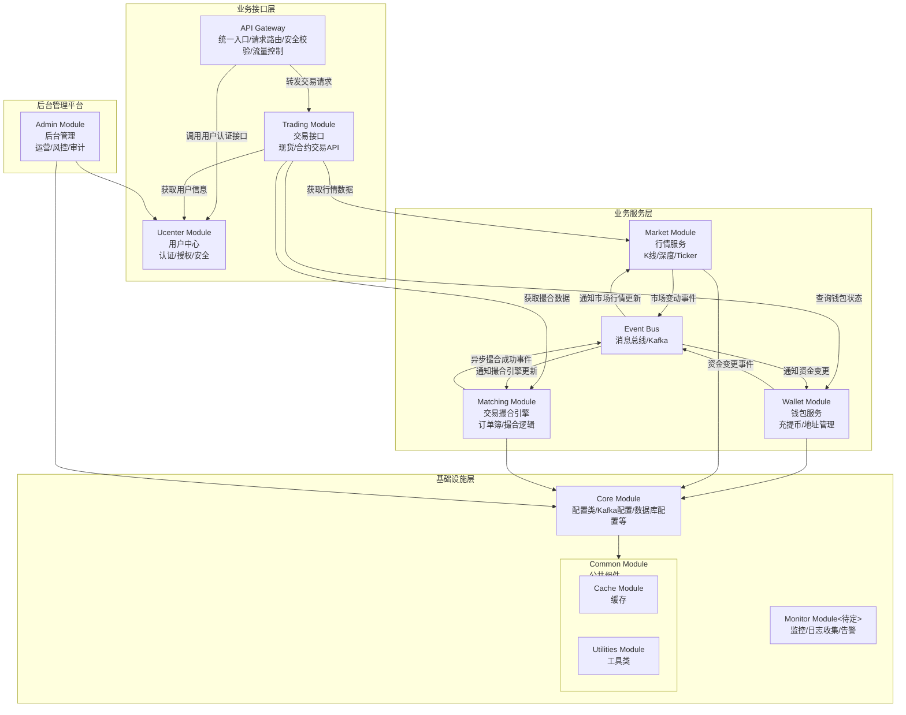

# quantax_lab
## overview structure
- quantax_lab_common
- quantax_lab_core
- quantax_lab_ucenter
- quantax_lab_wallet
- quantax_lab_market
- quantax_lab_matching
- quantax_lab_trading
- quantax_lab_admin

