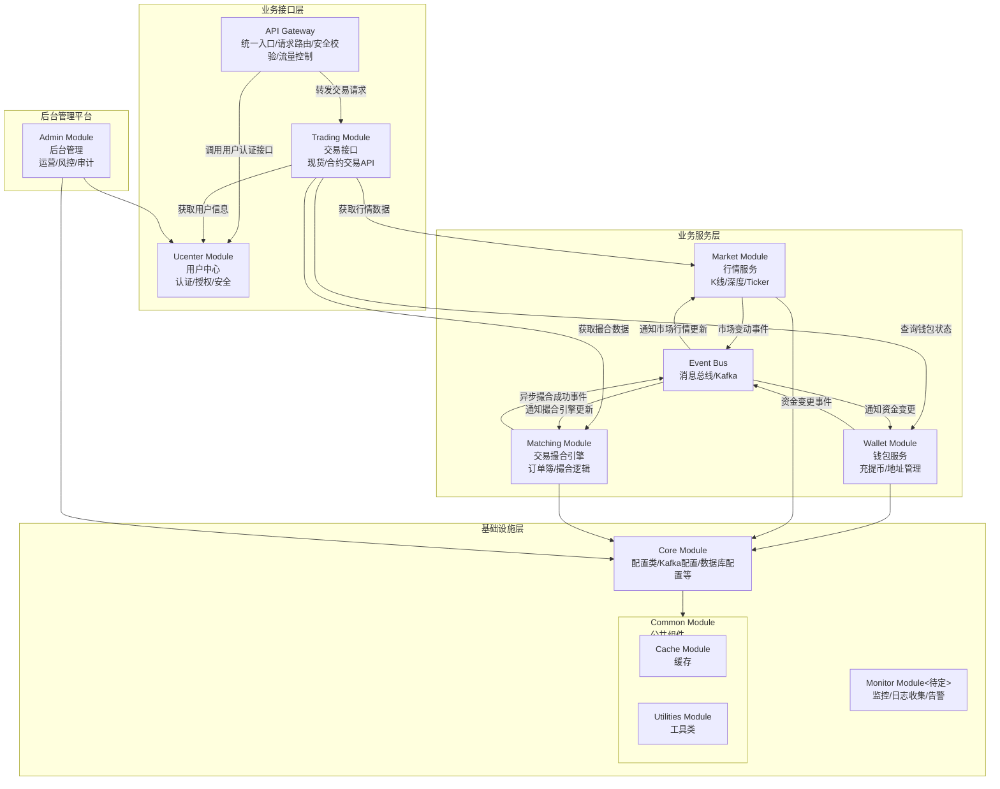
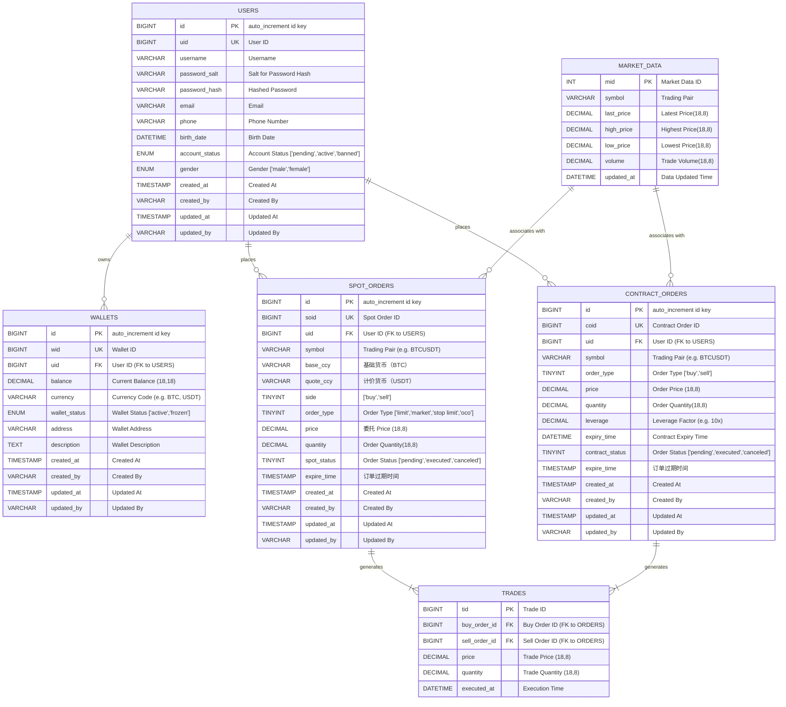

# quantax_lab
## Services & Dependencies Diagram

```mermaid
graph TD
    %% 业务接口层
    subgraph 业务接口层
        quantax_lab_gateway[API Gateway<br>统一入口/请求路由/安全校验/流量控制]
        quantax_lab_ucenter[Ucenter Module<br>用户中心<br>认证/授权/安全]
        quantax_lab_trading[Trading Module<br>交易接口<br>现货/合约交易API]
    end

    %% 业务服务层
    subgraph 业务服务层
        quantax_lab_wallet[Wallet Module<br>钱包服务<br>充提币/地址管理]
        quantax_lab_market[Market Module<br>行情服务<br>K线/深度/Ticker]
        quantax_lab_matching[Matching Module<br>交易撮合引擎<br>订单簿/撮合逻辑]
        quantax_lab_event_bus[Event Bus<br>消息总线/Kafka]
    end

    %% 基础设施层
    subgraph 基础设施层
        %% common 子模块
        subgraph quantax_lab_common[Common Module<br>公共组件]
            quantax_lab_common_cache[Cache Module<br>缓存]
            quantax_lab_common_utils[Utilities Module<br>工具类]
        end
        quantax_lab_core[Core Module<br>配置类/Kafka配置/数据库配置等]
        quantax_lab_monitor[Monitor Module<待定><br>监控/日志收集/告警]
    end

    %% 后台管理平台
    subgraph 后台管理平台
        quantax_lab_admin[Admin Module<br>后台管理<br>运营/风控/审计]
    end

%% 依赖关系
    quantax_lab_gateway -- "调用用户认证接口" --> quantax_lab_ucenter
    quantax_lab_gateway -- "转发交易请求" --> quantax_lab_trading

    quantax_lab_trading -- "获取用户信息" --> quantax_lab_ucenter
    quantax_lab_trading -- "获取行情数据" -->  quantax_lab_market
    quantax_lab_trading -- "获取撮合数据" --> quantax_lab_matching
    quantax_lab_trading -- "查询钱包状态" -->  quantax_lab_wallet

    quantax_lab_matching -- "异步撮合成功事件" --> quantax_lab_event_bus
    quantax_lab_wallet -- "资金变更事件" --> quantax_lab_event_bus
    quantax_lab_market -- "市场变动事件" --> quantax_lab_event_bus

    quantax_lab_event_bus -- "通知资金变更" --> quantax_lab_wallet
    quantax_lab_event_bus -- "通知市场行情更新" --> quantax_lab_market
    quantax_lab_event_bus -- "通知撮合引擎更新" --> quantax_lab_matching


    quantax_lab_wallet --> quantax_lab_core
    quantax_lab_market --> quantax_lab_core
    quantax_lab_matching --> quantax_lab_core
    quantax_lab_core --> quantax_lab_common


    quantax_lab_admin --> quantax_lab_core
    quantax_lab_admin --> quantax_lab_ucenter
```

```mermaid
erDiagram
    %% 用户中心：用户基本信息
    USERS {
        BIGINT id PK "auto_increment id key"
        BIGINT uid UK "User ID"
        VARCHAR username "Username"
        VARCHAR password_salt "Salt for Password Hash"
        VARCHAR password_hash "Hashed Password"
        VARCHAR email "Email"
        VARCHAR phone "Phone Number"
        DATETIME birth_date "Birth Date"
        ENUM account_status "Account Status ['pending','active','banned'] "
        ENUM gender "Gender ['male','female']"
        TIMESTAMP created_at "Created At"
        VARCHAR created_by "Created By"
        TIMESTAMP updated_at "Updated At"
        VARCHAR updated_by "Updated By"

    }

    %% 钱包模块：每个用户可以有一个或多个钱包记录
    WALLETS {
        BIGINT id PK "auto_increment id key"
        BIGINT wid UK "Wallet ID"
        BIGINT uid FK "User ID (FK to USERS)"
        DECIMAL balance "Current Balance (18,18)"
        VARCHAR currency "Currency Code (e.g. BTC, USDT)"
        ENUM wallet_status "Wallet Status ['active','frozen']"
        VARCHAR address "Wallet Address"
        TEXT description "Wallet Description"
        TIMESTAMP created_at "Created At"
        VARCHAR created_by "Created By"
        TIMESTAMP updated_at "Updated At"
        VARCHAR updated_by "Updated By"
    }

    %% 现货订单：记录用户下单信息（交易接口模块提交订单）
    SPOT_ORDERS {
        BIGINT id PK "auto_increment id key"
        BIGINT soid UK "Spot Order ID"
        BIGINT uid FK "User ID (FK to USERS)"
        VARCHAR symbol "Trading Pair (e.g. BTCUSDT)"
        VARCHAR base_ccy "基础货币（BTC）"
        VARCHAR quote_ccy "计价货币（USDT）"
        TINYINT side "['buy','sell']"
        TINYINT order_type "Order Type ['limit','market','stop limit','oco']"
        DECIMAL price "委托 Price (18,8)"
        DECIMAL quantity "Order Quantity(18,8)"
        TINYINT spot_status "Order Status ['pending','executed','canceled']"
        TIMESTAMP expire_time "订单过期时间"
        TIMESTAMP created_at "Created At"
        VARCHAR created_by "Created By"
        TIMESTAMP updated_at "Updated At"
        VARCHAR updated_by "Updated By"

    }

    %% 合约订单：记录用户下单信息（交易接口模块提交订单）
    CONTRACT_ORDERS {
        BIGINT id PK "auto_increment id key"
        BIGINT coid UK "Contract Order ID"
        BIGINT uid  FK "User ID (FK to USERS)"
        VARCHAR symbol "Trading Pair (e.g. BTCUSDT)"
        TINYINT order_type "Order Type ['buy','sell']"
        DECIMAL price "Order Price (18,8)"
        DECIMAL quantity "Order Quantity(18,8)"
        DECIMAL leverage "Leverage Factor (e.g. 10x)"
        DATETIME expiry_time "Contract Expiry Time"
        TINYINT contract_status "Order Status ['pending','executed','canceled']"
        TIMESTAMP expire_time "订单过期时间"
        TIMESTAMP created_at "Created At"
        VARCHAR created_by "Created By"
        TIMESTAMP updated_at "Updated At"
        VARCHAR updated_by "Updated By"
    }

    %% 成交记录：撮合成功后生成的成交记录（交易撮合模块生成）
    TRADES {
        BIGINT tid PK "Trade ID"
        BIGINT buy_order_id FK "Buy Order ID (FK to ORDERS)"
        BIGINT sell_order_id FK "Sell Order ID (FK to ORDERS)"
        DECIMAL price "Trade Price (18,8)"
        DECIMAL quantity "Trade Quantity (18,8)"
        DATETIME executed_at "Execution Time"
    }

    %% 市场数据：行情数据（行情模块采集或聚合外部数据）
    MARKET_DATA {
        INT mid PK "Market Data ID"
        VARCHAR symbol "Trading Pair"
        DECIMAL last_price "Latest Price(18,8)"
        DECIMAL high_price "Highest Price(18,8)"
        DECIMAL low_price "Lowest Price(18,8)"
        DECIMAL volume "Trade Volume(18,8)"
        DATETIME updated_at "Data Updated Time"
    }

    %% 关系定义
    USERS ||--o{ WALLETS : "owns"
    USERS ||--o{ SPOT_ORDERS : "places"
    USERS ||--o{ CONTRACT_ORDERS : "places"
    SPOT_ORDERS ||--|{ TRADES : "generates"
    CONTRACT_ORDERS ||--|{ TRADES : "generates"
    MARKET_DATA ||--o{ SPOT_ORDERS : "associates with"
    MARKET_DATA ||--o{ CONTRACT_ORDERS : "associates with"
```
## Overview Structure

