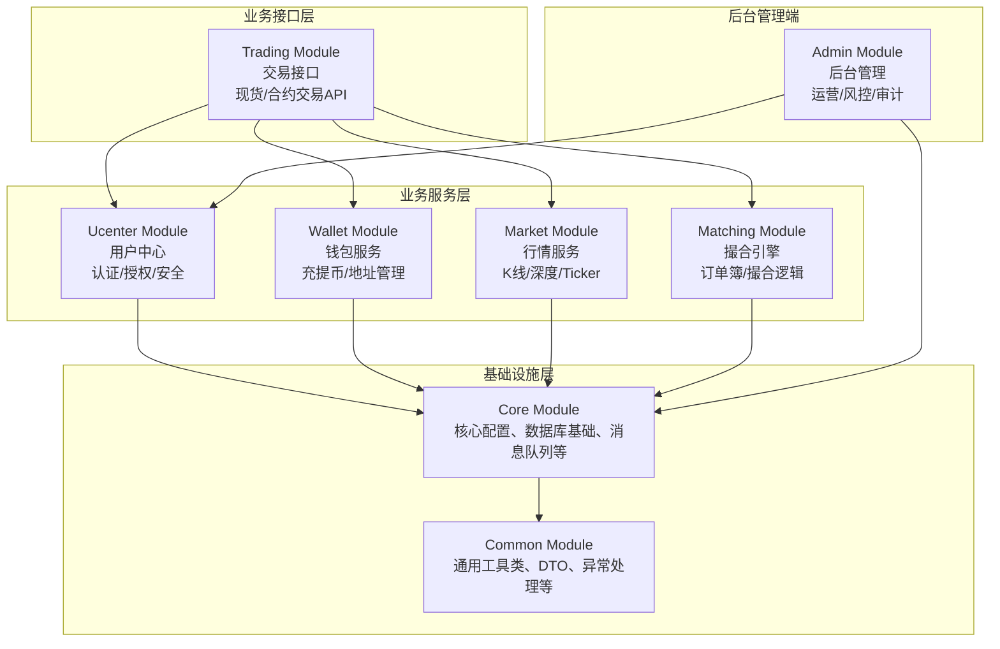

# quantax_lab
## overview structure

# quantax_lab_common
## this module is used to store the common code for other modules
# quantax_lab_core
## this module is used to store the core code for other modules

# quantax_lab_market
## 行情模块
# quantax_lab_trading
## 交易模塊包括合約以及現貨
# quantax_lab_ucenter
## 用戶中心模塊

# quantax_lab_wallet
## 錢包模塊
# quantax_lab_matching
## 交易撮合模塊

-- admin --
# quantax_lab_admin
## 后台管理端

